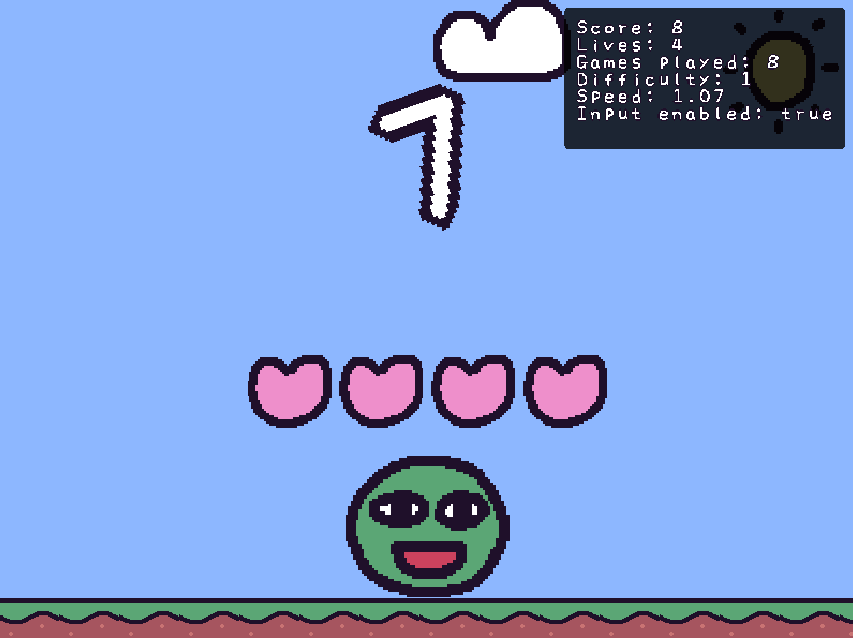

# KAPLAYWARE
yea

## How to add game????
To make a new game do:
```sh
$ npm run create-game {yourname}:{gamename}
# for example
$ npm run create-game wario:squeeze
```

When you make it the urlPrefix for your game will automatically be created from your user folder, so it will look something like this
`games/wario/assets`

Then you can reference this folder in your games like
```ts
{
    load(ctx) {
        ctx.loadSprite("mario", "/sprites/mario.png");
    },
}
```

## Default assets
If you want to use assets created by kaplay, you can use all the assets found in the `crew` package! but you have to prefix your sprite with "@"
```ts
ctx.add([
    ctx.sprite("@bean")
])
```

## Mouse games
If you're going to make a game that uses the mouse, you need to specify it on your game data, it would look something like this
```ts
const newGame: Minigame = {
    // ...
    mouse: { hidden: false }
    start(ctx) {
        // ...
    }
}
```

You can also use `hidden: true` If you're going to make a game that uses a custom cursor, for more info you can check the [SLAP!](/games/amyspark-ng/slap.ts) minigame or the [HIT!](/games/amyspark-ng/hit.ts) minigame, which use a custom cursor (hand sprites)

- Please refrain to use `onMousePress`!! You can use `ctx.onClick()` and `obj.onClick`, but no mouse button (mouse minigames are only allowed to be played with left click)
- If you're making a mouse minigame and you have an object with an area and you'd like for the cursor to not point at this object, you can tag it with with "ignorepoint"
```ts
ctx.add([
    ctx.area(),
    "ignorepoint"
])
```

### Debug keybinds:
* `Q` - Restart minigame
* `Shift + Q` - Skip minigame
* `Shift + W` - Restart with speed up
* `1, 2, 3` - Restart with new difficulty (wanted to make it with shift but it's not working)
* If you press F2 you'll get a panel that shows some kaplayware info (inputEnabled, score, lives, speed, difficulty, etc) 

